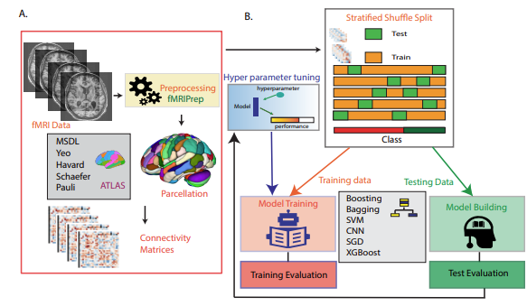
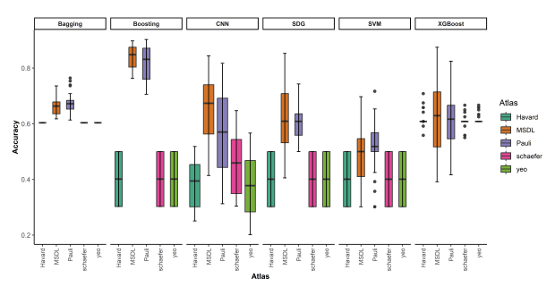
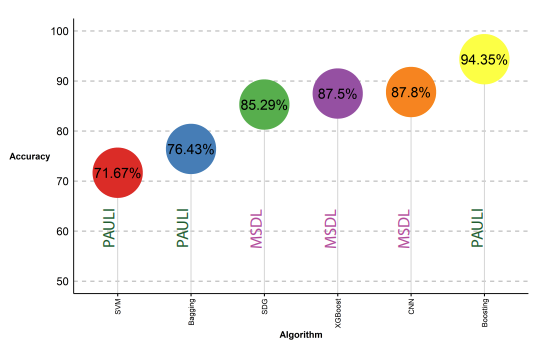

# Classification of Chronic Pain Using fMRI Data: Unveiling Brain Activity Patterns for Diagnosis

## Introduction
Millions of people worldwide suffer from chronic pain, a complex and debilitating condition that lasts for more than three months. This study aims to understand the brain processes behind pain and develop prediction models using machine learning techniques applied to fMRI data.

## Materials and Methods

### Dataset
Data from 76 participants (30 chronic pain patients and 46 healthy controls) were used. The fMRI data were preprocessed using fMRIprep and parcellated using various atlases, including MSDL, Yeo’17, Harvard, Schaefer, and Pauli.

### Participants
Participants included both chronic pain patients and healthy controls. The demographic details of the participants are provided in the study.

### fMRI Preprocessing
Preprocessing involved steps such as intensity normalization, image alignment, skull stripping, spatial normalization, and brain tissue segmentation using standard software packages like FSL, ANTs, FreeSurfer, and AFNI.

### Brain Functional Parcellation
Five atlases were used to parcellate the brain into regions of interest (ROIs) to analyze the data.

### Feature Extraction
Functional connectivity between the parcellated ROIs was used as features for the machine learning classifiers. The features were extracted using the Nilearn library.

### Machine Learning Classification Models
Six machine learning models were used: Support Vector Machines (SVM), Stochastic Gradient Descent (SDG), Convolutional Neural Network (CNN), Bagging, Boosting, and XGBoost.

### Hyperparameter Tuning
Hyperparameter tuning was performed using GridSearchCV to find the best parameters for each classifier.

### Training and Evaluation
The models were trained and evaluated using stratified shuffle split cross-validation. Performance metrics included accuracy, sensitivity, and specificity.

## Results

### Analysis on Accuracy, Sensitivity, and Specificity
The study found that the Pauli and MSDL atlases performed best for classifying chronic pain patients. The Boosting algorithm achieved the highest accuracy of 94.35% using the Pauli atlas.

### Region of Interests Contributing to Chronic Pain Classification
Key brain regions contributing to chronic pain classification were identified using probability-based feature importance methods. Top regions included the extended Amygdala, Subthalamic nucleus, Hypothalamus, and Caudate Nucleus for the Pauli atlas and the Left Frontal Pole, Medial Default Mode Network, and others for the MSDL atlas.

## Discussion
The study's findings indicate that specific brain activity patterns can reliably classify individuals as chronic pain patients or healthy controls. These insights could inform better diagnostic and therapeutic strategies for chronic pain.

## Conclusion
The study demonstrates the potential of using machine learning and fMRI data to classify chronic pain patients, with promising accuracy, sensitivity, and specificity metrics. Further research is needed to refine these methods and explore their application in clinical settings.

## Acknowledgment
The experimental design was conceptualized by Rejula V, Anitha J, and Belfin R V. Preprocessing tasks were undertaken collaboratively by Rejula V and Belfin R V. The execution of the Machine Learning analyses was conducted by Rejula V, while the interpretation of the results was a joint effort involving Rejula V, Anitha J, and Belfin R V.

## Cite
ROBINSON, B. (2023). Classification of chronic pain using fMRI data: Unveiling brain activity patterns for diagnosis. Turkish Journal of Electrical Engineering and Computer Sciences, 31(6), 1061-1078.

